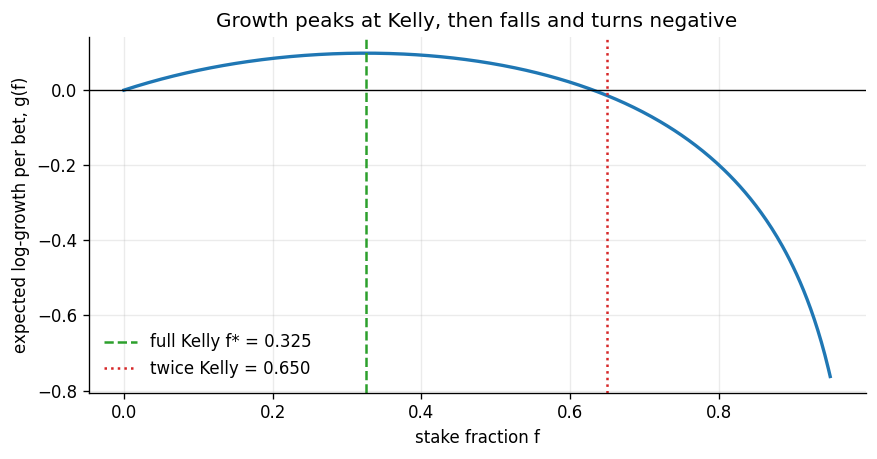

# KellyLab

A study of the Kelly criterion on **simulated data only**, extending my calculator app [KellyEdge](https://github.com/YOJITM05/kellyedge).
KellyEdge computes a stake from `f* = p - (1 - p) / b`. KellyLab asks the harder questions: where the formula comes from, how risky it is, and what happens when the estimate of the odds is wrong.



## What is inside

| File | What it is |
|---|---|
| `KellyLab.ipynb` | The study: derivation, growth curve, 10,000-path simulation, estimation-error experiment, model-risk chart, continuous Kelly, limits, and self-check questions. Outputs are saved in the file. |
| `kellylab.py` | Small, tested helper functions used by the notebook. |
| `tests/test_kellylab.py` | 18 tests (formula, growth maximum, simulation, drawdown, estimation error, shrinkage rule). |
| `figures/` | The six charts as PNG files. |
| `KellyLab_Report.pdf` | The same results as a short document, for readers without Jupyter. |

## Main results (p = 0.55, b = 2, so full Kelly f* = 0.325; 10,000 paths of 500 bets, seed 42)

| Stake | f | Median growth per bet | Median worst drawdown | Paths falling below 1% of start | Paths ending below start |
|---|---|---|---|---|---|
| 0.25x Kelly | 0.081 | 0.0447 | 50% | 0.0% | 0.0% |
| 0.5x Kelly | 0.163 | 0.0750 | 78% | 0.0% | 0.0% |
| 1x Kelly | 0.325 | 0.0986 | 98% | 0.7% | 0.0% |
| 1.5x Kelly | 0.488 | 0.0735 | 100% | 20.1% | 0.8% |
| 2x Kelly | 0.650 | -0.0143 | 100% | 87.1% | 62.0% |

1. **Growth peaks at full Kelly** and turns negative a little before twice Kelly (1.95x for this edge). Simulated growth matches the formula.
2. **Drawdowns are large even at Kelly.** The median path's worst peak-to-trough fall is 98% at full Kelly and 78% at half-Kelly.
3. **Estimation error changes the answer.** With a strong edge, betting close to full Kelly is fine once you have around 50 observations. With a weak edge (p = 0.52, b = 1), betting the full estimated Kelly after 100 trades has negative long-run growth, and the best fraction is about 0.3. A rule of thumb for the fraction is `k = mu^2 / (mu^2 + s^2)`, where `s` is the noise in the estimated edge.
4. **Model risk.** Sized for p = 0.55 at full Kelly, growth is negative if the true p is below 0.440; at half-Kelly the threshold is 0.387.
5. **Continuous version.** For 8% mean and 20% volatility a year, Kelly leverage is `mu / sigma^2 = 2.0`x.

## Run it

```
pip install -r requirements.txt
python -m pytest
jupyter notebook KellyLab.ipynb
```

## Limits

Independent bets, fixed known odds, no costs, normal returns in the continuous section, one bet at a time, simulated data. Nothing here has been tested on market data and nothing here is trading advice.

## Authorship

Built with AI assistance (Claude). The final section of the notebook lists ten questions I use to check that I can explain every step.
